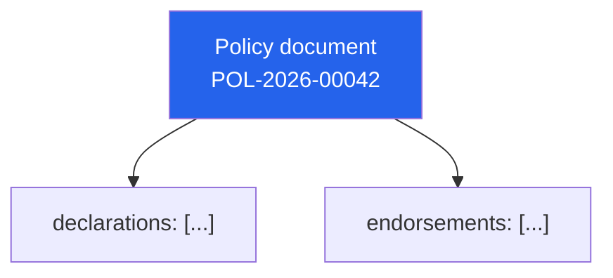
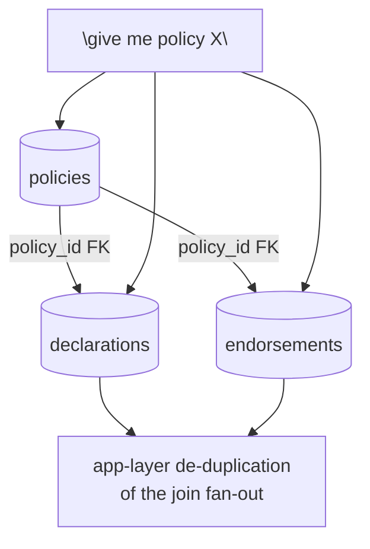

# Model comparison

## Document-oriented (this repo's default)

One key, one read, the whole aggregate comes back together.

## Relational decomposition (`src/relational_equivalent.sql`)

Same information, three tables, a join, and a de-duplication step the
application has to own.

Neither shape is universally correct. The question this repo is trying to
make concrete is: *does this business entity behave like a document
(hierarchical, read as a whole, written rarely) or like a set (queried
across many records, updated independently, needing referential
integrity across a wide graph)?* Model to the shape of the domain, not to
habit.
